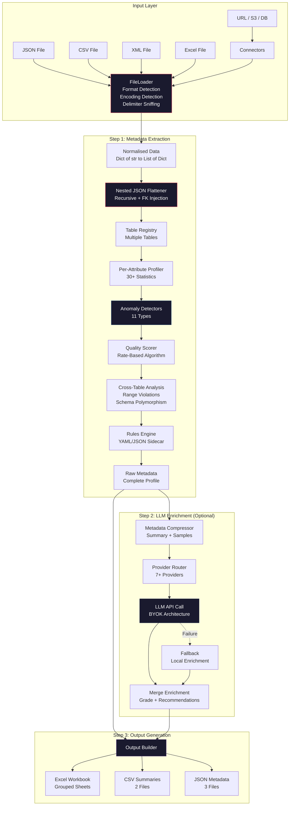
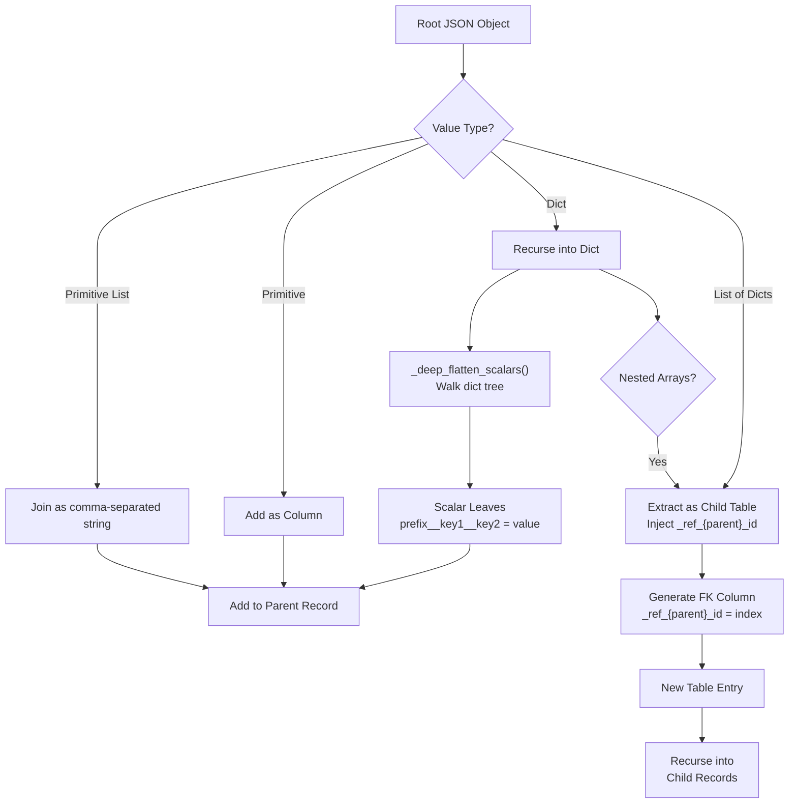
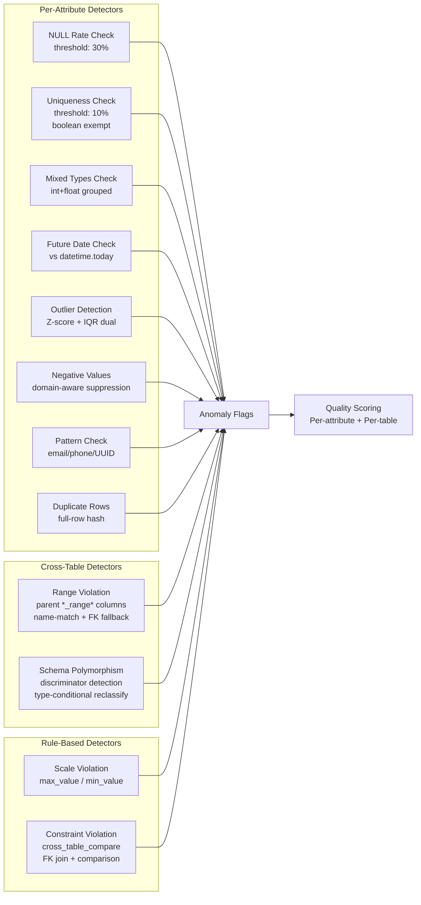
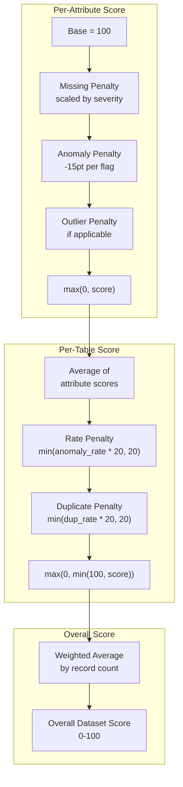
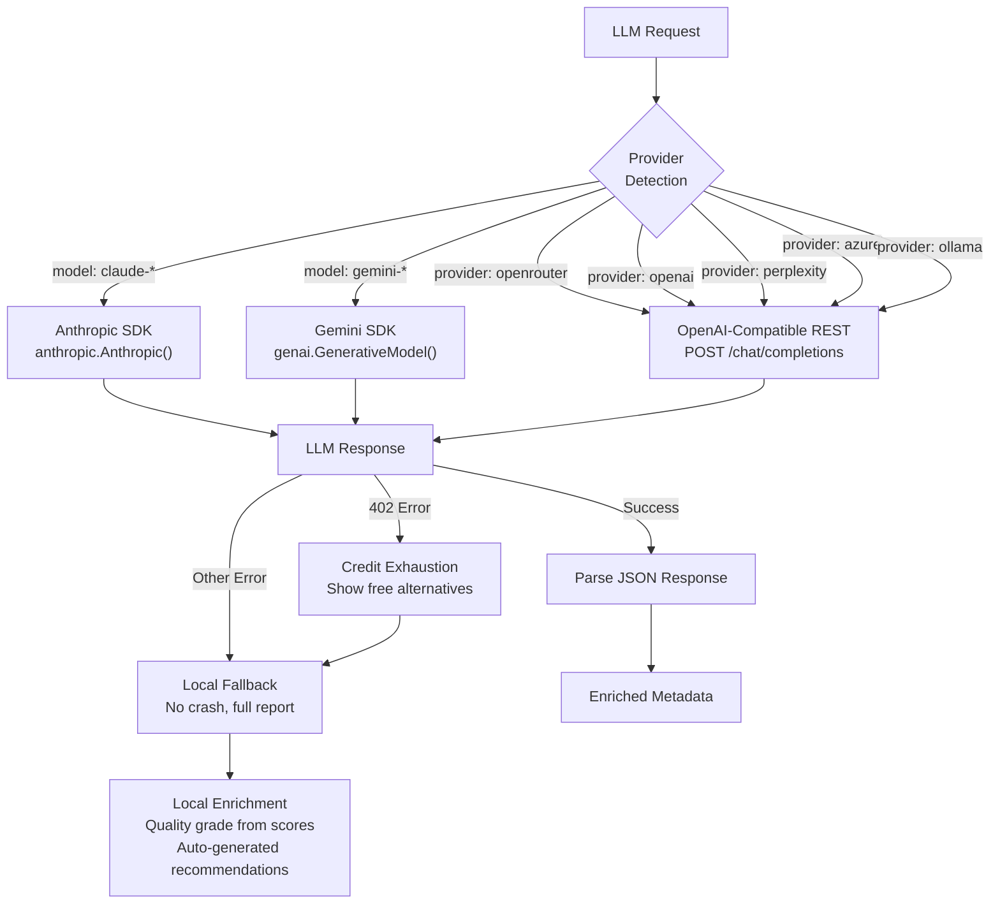
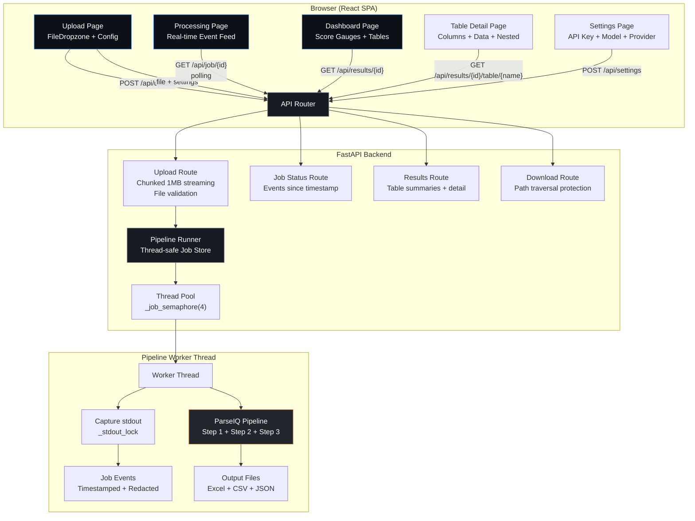
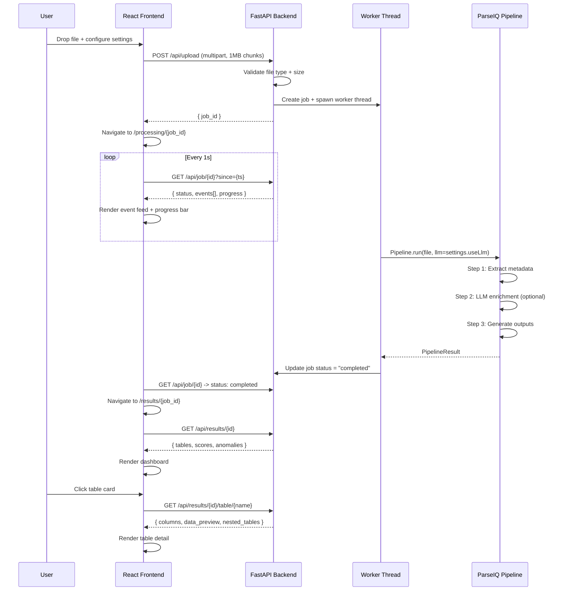
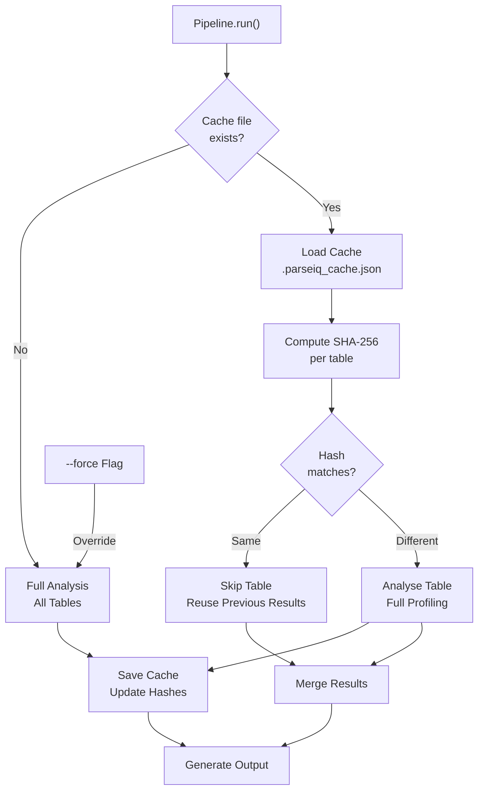
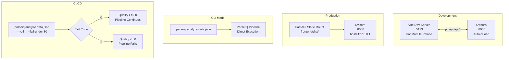

# ParseIQ — System Architecture & Workflow Diagrams

> Author: Shriniwas Ahirrao
> Project: ParseIQ — AI-Powered Data Quality Agent
> Date: April 2026

---

## 1. High-Level System Architecture



---

## 2. Nested JSON Flattening Pipeline



### Flattening Example

```
Input:
{
  "departments": [
    {
      "name": "Engineering",
      "head": {
        "name": "Alice",
        "performance": {
          "fy2025": { "rating": 4.5, "bonus": 15000 }
        }
      },
      "team": [
        { "name": "Bob", "role": "SDE" },
        { "name": "Carol", "role": "PM" }
      ]
    }
  ]
}

Output Tables:
  departments:
    | name        | head__name | head__performance__fy2025__rating | head__performance__fy2025__bonus |
    |-------------|------------|-----------------------------------|----------------------------------|
    | Engineering | Alice      | 4.5                               | 15000                            |

  team:
    | _ref_departments_id | name  | role |
    |---------------------|-------|------|
    | 0                   | Bob   | SDE  |
    | 0                   | Carol | PM   |
```

---

## 3. Anomaly Detection Pipeline



---

## 4. Quality Scoring Algorithm



### Why Rate-Based Penalty?

**Before (v0.0.2)**: `table_penalty = total_anomalies * 3`
- Problem: Wide table with 62 columns and 40 anomalies -> penalty = 120 -> score = 0
- Root cause: Raw count grows linearly with table width

**After (v0.0.3)**: `table_penalty = min(anomaly_rate * 20, 20)`
- Fix: Penalty is proportional to fraction of affected columns, capped at 20
- Result: Same table -> penalty = min(40/62 * 20, 20) = 12.9 -> meaningful non-zero score

---

## 5. LLM Provider Routing



---

## 6. Web UI Architecture



### Thread Safety Model

```
Main Thread (FastAPI/Uvicorn)
    |
    +-- Request Handler
    |       |
    |       +-- _jobs_lock.acquire()
    |       +-- Read/write _jobs dict
    |       +-- _jobs_lock.release()
    |
    +-- Background Workers (up to 4)
            |
            +-- _job_semaphore.acquire()  # blocks if 4 running
            +-- _stdout_lock.acquire()
            +-- sys.stdout = StringIO()   # capture pipeline output
            +-- _stdout_lock.release()
            +-- Run ParseIQ pipeline
            +-- _stdout_lock.acquire()
            +-- sys.stdout = original     # restore
            +-- _stdout_lock.release()
            +-- _job_semaphore.release()
```

---

## 7. Data Flow — End to End



---

## 8. Excel Output Structure

```
complete_data_analysis.xlsx
|
+-- 00_Summary
|   [Table_Name | Records | Quality_Score | Anomalies | Top_Issues]
|
+-- 01_LLM_Assessment  (if LLM used)
|   [Quality_Grade | Overall_Score | Production_Readiness |
|    Key_Strengths | Primary_Concerns | Model_Used]
|
+-- 02_LLM_Recommendations  (if LLM used)
|   [Priority | Category | Recommendation | Expected_Impact | Effort]
|
+-- Data_employees        <- Raw data rows
+-- Meta_employees        <- 30-column attribute profile
+-- Quality_employees     <- Long-format quality metrics
|
+-- Data_departments
+-- Meta_departments
+-- Quality_departments
|
+-- ... (3 sheets per table, grouped)
|
+-- 99_Issues_Recommendations
    [Priority | Table | Column | Issue_Type | Description |
     Business_Impact | Recommended_Fix | Effort]
    (Sorted: CRITICAL -> HIGH -> MEDIUM -> LOW)
```

---

## 9. Incremental Processing Flow



---

## 10. Configuration Priority Chain

```
Highest Priority
    |
    v
[1] Pipeline.run() Parameters
    llm_api_key="sk-...", llm_model="gpt-4o"
    |
    v
[2] CLI Flags
    --llm-api-key, --llm-model, --llm-provider
    |
    v
[3] Environment Variables
    OPENROUTER_API_KEY, OPENAI_API_KEY, etc.
    |
    v
[4] .env File (auto-loaded if python-dotenv installed)
    OPENROUTER_API_KEY=sk-or-v1-...
    |
    v
[5] Built-in Defaults
    provider=openrouter, model=nvidia/nemotron-3-super-120b-a12b:free

Lowest Priority
```

---

## 11. Deployment Topology



---

## 12. Component Interaction Map

```
parseiq/
  __init__.py          <-- Public API surface
       |
  pipeline.py          <-- Orchestrator (Step 1 + 2 + 3)
       |
       +-- file_loader/loader.py
       |       |
       |       +-- _flatten_nested_json()
       |       +-- _deep_flatten_scalars()
       |       +-- _load_json/csv/xml/excel()
       |
       +-- step1_metadata_extractor/extractor.py
       |       |
       |       +-- _analyze_table_detailed()
       |       +-- _detect_anomalies()
       |       +-- _detect_schema_groups()
       |       +-- _calculate_quality_score()
       |       +-- _detect_cross_level_range_violations()
       |       +-- utils.py (zscore, IQR)
       |
       +-- step2_llm_enricher/llm_agent.py
       |       |
       |       +-- _detect_provider()
       |       +-- _make_api_request_anthropic()
       |       +-- _make_api_request_gemini()
       |       +-- _make_api_request_openai_compatible()
       |       +-- _create_fallback_enrichment()
       |       +-- _calculate_corrected_quality_score()
       |
       +-- _generate_outputs()
       |       +-- Excel: 00_Summary, 01/02_LLM, Data/Meta/Quality per table, 99_Issues
       |       +-- CSV: summary + issues
       |       +-- JSON: raw + enriched + pipeline_info
       |
       +-- _find_rules_file() / _load_rules() / _apply_rules()
       +-- alerts.py (post-analysis rule evaluation)
       +-- result.py (PipelineResult dataclass)

  connectors/
       +-- file.py    <-- Local files
       +-- url.py     <-- HTTP/S download
       +-- s3.py      <-- Amazon S3
       +-- postgres.py <-- PostgreSQL
       +-- mongodb.py  <-- MongoDB

  _cli.py              <-- CLI entry point (parseiq command)
       +-- analyze, validate, init, models, config, version

web/
  run.py               <-- Dev/prod launcher
  api/
       +-- main.py     <-- FastAPI app, CORS, exception handlers
       +-- routes/upload.py     <-- Chunked multipart upload
       +-- routes/results.py    <-- Table summaries + detail + download
       +-- routes/settings.py   <-- Configuration endpoints
       +-- services/pipeline_runner.py  <-- Thread-safe job management
  frontend/
       +-- src/App.tsx          <-- Router + ErrorBoundary
       +-- src/pages/           <-- 5 page components
       +-- src/components/      <-- 8+ reusable components
       +-- src/hooks/           <-- useJobPoller
       +-- src/lib/             <-- API client + types
```
